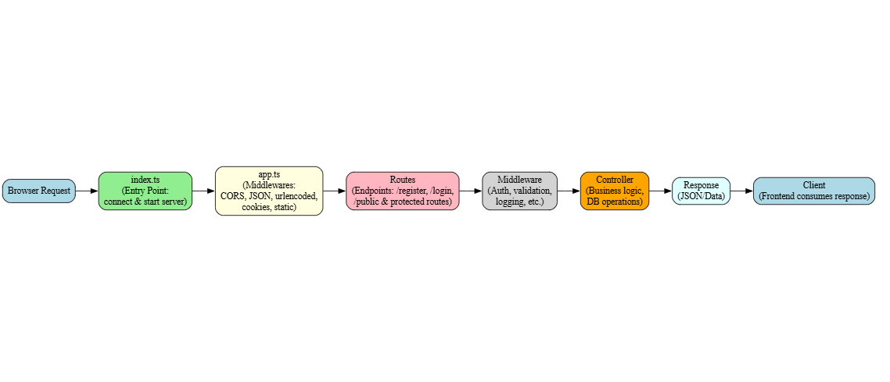

# flow of backend 

    --> browser request 
    --> express( index.ts) 
    --> for very first the index file is try to connect the server and waiting for true result, if the connection is successfull the app starts running on the server port 8000 
    --> app.ts sets the cors, parse the json and set limit for json as well, urlencodeing:This middleware allows Express to read and parse HTML form submissions safely, supporting nested data, while ensuring no more than 20kb of data is accepted, set the cookie parser, set the express to use public assests 
    --> within the app.ts import the routes from router dir and set the base url with api version ---> the route file defines the all visiting routes that responsible to run the task or function ---> and set the free routes like register login and secured/protected routes with corresponding routing methods like [get, post, put, delete] in same route.ts file 
    --> when the client made the request by visting the same routes the response send to the client --> here we can also add the middlewares 
    ---> Models (database schemas, ORM layer)
    --> the corresponding route controller perform the next actions 
    --> the controller return the something as response that feeds to the frontend --> 

------------------------------------------------------

Here’s the modernized flow with a chart 👇
### ⚡ Modernized Express App Flow

**Browser request**
\---> **index.ts (entry point)**

* Connects to database/server.
* If connection succeeds → starts app on server port (e.g., 8000).

\---> **app.ts (app configuration)**

* Sets up **CORS**.
* Parses **JSON body** with size limit (e.g., 20kb).
* Parses **URL-encoded form data** (supports nested objects).
* Uses **cookie parser**.
* Serves **public assets (static files)**.
* Mounts routes with a **base URL** (e.g., `/api/v1`).

\---> **routes (router directory)**

* Defines all **routes** (`/register`, `/login`, `/users`, etc.).
* Splits between **public routes** (register, login) and **protected routes** (need auth).
* Routes use HTTP methods: **GET, POST, PUT, DELETE**.
* Can attach **middlewares** (e.g., authentication, validation).

\---> **controllers**

* Each route calls its **controller function**.
* Controller runs business logic (e.g., database operations, validations).
* Returns a **response (JSON/data)**.

\---> **client (browser/frontend)**

* Receives the response and renders it in UI.

### 📌 Arrow-Style Flow Chart

```
Browser Request 
   ---> index.ts (entry point: connect & start server)
   ---> app.ts (middlewares: CORS, JSON, urlencoded, cookies, static)
   ---> Routes (define endpoints & methods)
   ---> Middleware (auth, validation, logging, etc.)
   ---> Models (database schemas, ORM layer)
   ---> Controller (business logic, DB operations)
   ---> Response (JSON/data)
   ---> Client (frontend consumes response)
```
# Express App Flow 

